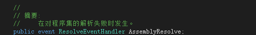

# 组件模组引用第三方组件问题
对接上一文章由于是动态加载指定程序集，会把当前目录下所有dll都加载进来。如果像sqlite这种第三组件调用了由C、C++非.net语言所以生成的Dll。因为自动生成的原因。会把非C#生成的dll都加载入来导致加载失败。程序异常。那结果当然不是我们想要的结果了。
 

怎么避免这类事情的发现。那竟然不能加载所有dll了。那就再细化处理。如果有人把组件模组生成了exe那我们正常来说也应该要处理的。毕竟这也是.net所生成出来的项目。也可以动态加载才是正路。
按上一文章生成输出的设置。把每个组件模组生成到指定的目录中去。发下图（可参考上一文章IDE项目的设置）

 

优化加载管理类，把组件模组目录的一级目录当组件名称。一个组件占一个目录以组件模组命名目录。在加载组件时扫描第一层目录。通过第一层目录知道这个组件模组的主程序集。通过命名约束来找到主程序集引用加载。避免加载到非.net生成的dll。然后通过GetReferencedAssemblies方法找出组件模组引用的程序集，把相关的程序集一一加载。

 

加载组件模组引用第三方.net如图是第三方写的json组件。动态加载后再把这个第三方程序集也成功引用入到平台项目中。

 

然后运行的效果发现出错了说是调用不成功要引用的第三方组件，因为找不到那个文件。

 

竟然是找不到文件那要不把那个文件加入到目录试下。果然是能够运行起来了。

 

但这不科学不合理啊。我主程序都没有引用我怎么能够把第三方程序集放到根目录呢。那要是这样子我们还怎么扩展做组件模组。把所在第三方都放在根目录以要是项目引用很多第三方那很不好管理。要是管理不当，引用包的版本冲突这是有一定机率发现的。那竟然是找不到调用文件能不能在解释出错时返回一个正常的程序集包就行了吧。这理论上也是没毛病的。在AppDomaing下找到对应的事件。

 

那就对这事件进行下调用方法。

 

这段代码只要在执行组件模组前调用就行了。由于第三方程序集在组件管理器加载时已经被引用到appdomain中所以可以通过appdomain.GetAsseblies得到现在引用的所有程序集只要把当前版本的程序集返回结果就能让主程序找到要用的引用程序集。为了方便就只直写在Main方法的第一行中方便大家见到。运行效果就不贴图了。
但如引用sqlite这样的第三方组件，由于这第三方组件还调用了c写的SQLite.Interop.dll文件，还区分运行平台是32位系是64位程序。运行输出效果还是找不到指定文件。还是能够够通过把x64\x86这两个文件目录复制到根目录去这就解决问题了。

 
 
 

但这也还是在把东西复制到根目录啊，有没有办法解决这个问题呢。调用非.net的dll主要是思路基本上是找到第三方的dll的绝对路径，通过路径调用

- System.Runtime.InteropServices.DllImportAttribute(string dllName)
- System.Runtime.InteropServices.UnmanagedFunctionPointerAttribute()

这类方法去调用非.net的dll文件的指定方法。这主要还是看写组件开发者的写法，像system.data.sqlite的开发者还提供dll配置方式。可以在初始化时加入配置。然后执行的效果和上面一样。运行效果就不贴图了。

 

但如果没有配置的是不是一定要把dll放在根目录上呢。这个问题是关于程序域（AppDomain）的问题